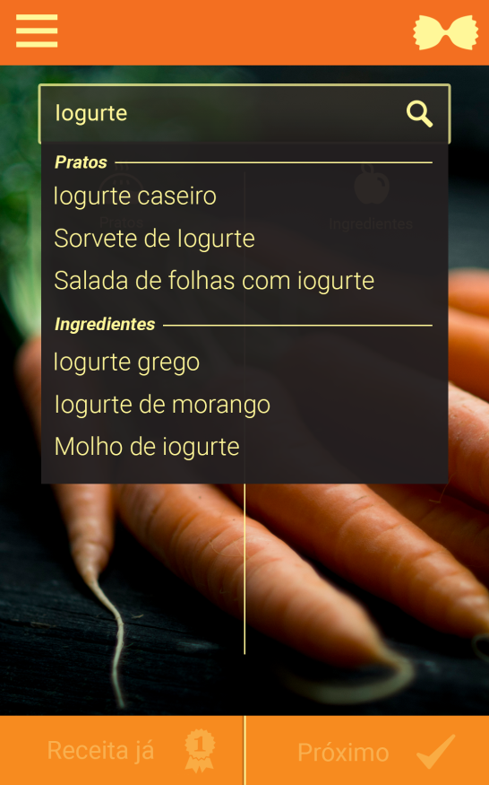
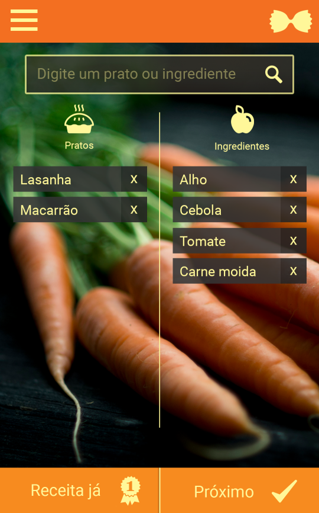
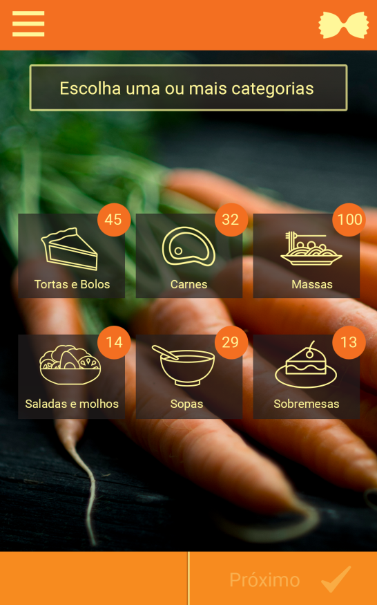
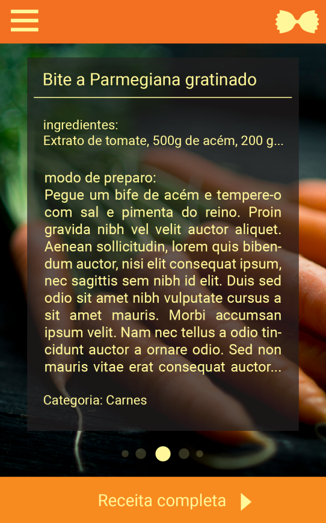

## Eu Chef Back-end 

Eu Chef started with a Master's Degree project at the Federal University of Ouro Preto in which several culinary recipes from the Brazilian internet in Portuguese were collected and processed. This data was mined and saved in a MySQL database. The idea was to use this database to create a mobile application to search for culinary recipes by ingredients and dishes. What was done first was the indexing of this entire base in MySQL for Apache Lucene (NoSQL), aiming at an effective search on the back end.

This project uses Spring with Lucene for an effective search for recipes and MySQL for other types of data. It has authentication by email and password and also with Facebook. This project was developed between July 2016 and August 2017.

## Images

### `Login:`

---

### `Search:`

---

### `Search Setup:`

---

### `Categories:`

---
### `Recipe:`

---